

### Hi, There! 👋

👨‍💻 Professional Software Engineer  
💻 Expert in Enterprise-Level Development with Web and Mobile Experience  
📈 Adherent to Agile Development Principles  
⚡ Innovator in Design and Collaboration  
🤖 Proficient in AI and ML Integration 
🎯 Stay up-to-date with IT industry trends  

 

I am a software engineer experienced in designing, developing, and implementing software solutions. Adept at collaborating with a lot of professional teams to analyze requirements and deliver scalable, and maintainable code within established timelines. Skilled in various programming languages and frameworks, with a strong foundation in software architecture, design patterns and life cycle. I thrive in collaborative team environments, deliver high quality, visually appealing results. I always remain abreast of industry trends and best practices, excel in forum discussionas and tackle coding challenges with other developers.

 

<h2 align="center">🛠️ Technologies and Tools 🛠️</h2>

  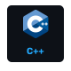
  
  
  
  
  
  
  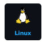
  
  
  
  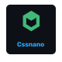
  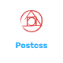
  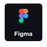
  
  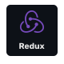
  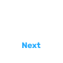
  
  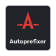
  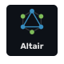
  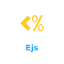
  
  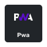
  
  
  
  
  
  
  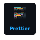
  
  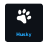
  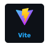
  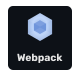
  
  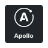
  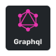
  
  
  
  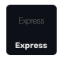
  
  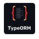
  
  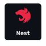
  
  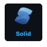
  
  
  
  
  
  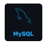
  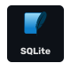
  
  
  
  
  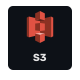
  

 
